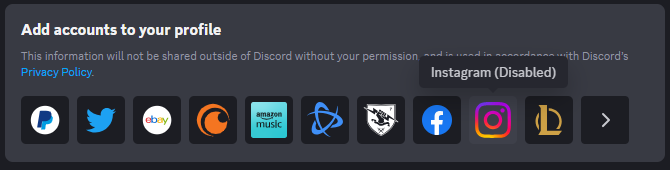

# AllConnectionsEnabled
Enables all connections (except for the Amazon Music you have to enable that via experiments)
> [!IMPORTANT]
> This plugin does not make the connections function, meaning for example if you click on Twitter (the old twitter connection not the one labeled X), nothing pops up for connection your account.
> Also for example, Instagram, it opens the page in a web browser, but will always fail when redirecting back to Discord.

## Installation

1. Clone Vencord and do the usual stuffs if you have not already. [Vencord Dev Docs](https://docs.vencord.dev)
    - https://docs.vencord.dev/installing/
    - https://docs.vencord.dev/installing/custom-plugins/
2. Open a terminal and change your current directory to the userplugins folder (and create the `userplugins` folder if you have not done that already), then type `git clone https://github.com/coopeeo/vc-allConnectionsEnabled allConnectionsEnabled`
3. Installed!
